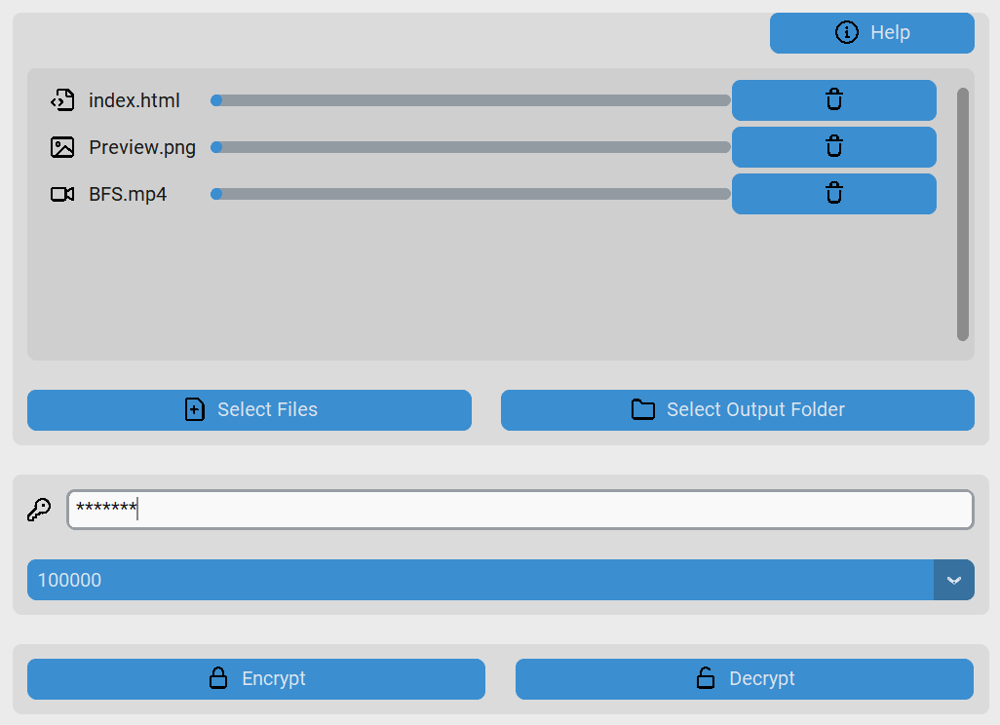

# File Encryption App

A secure, multi-threaded file encryption and decryption application built with **Python**, **CustomTkinter** and **PyCryptodome** supporting multiple file types (text, images, videos, and more).

## Features

- Supports multiple file types — from .txt to .png to .mp4.
- Multi-threaded processing — encrypt or decrypt several files in parallel.
- Preserves file extensions after decryption.
- User-friendly GUI.

## Preview

## Disclaimer

This software is provided for demonstration purposes only.
Use it at your own risk. The author assumes no responsibility for any damage or data loss.

## Credits

- [Octicons](https://primer.style/octicons/) by GitHub — Licensed under the [MIT License](https://github.com/primer/octicons/blob/main/LICENSE).
